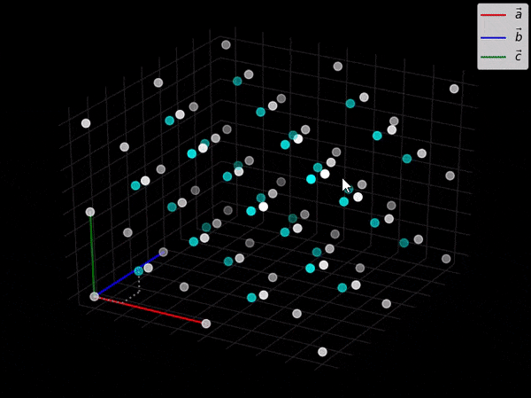
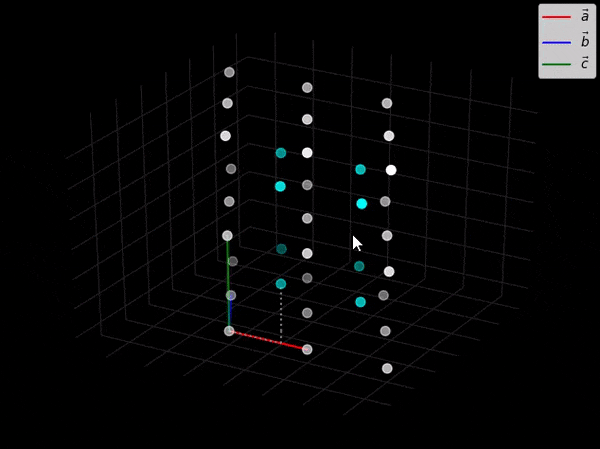
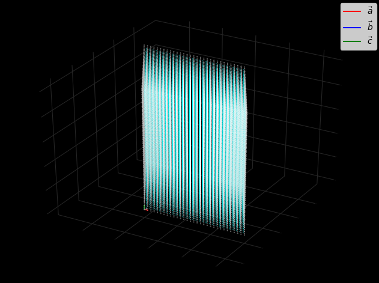

# CrystalGraphs

A tool for graphing multiple repetitions of the 3D Bravais lattices with a basis.

Images of the 3D Bravais lattices are easy to find, but I have not been able to find a simple method for viewing a 3D graph of many repetitions of the Bravais lattices with a specified basis. This module is a work in progress and currently allows for easily graphing the cubic, fcc, bcc, tetragonal, tetragonal body centered, and hexagonal crystal lattices.

As a quick example, using this module the crystal structure for diamond can be graphed in matplotlib by running the following code:

```
import CrystalGraphs
CrystalGraphs.fcc(2, [0,0,0,'white'], [.25,.25,.25,'cyan'], draw_path=True)
CrystalGraphs.show()
```

The number 2 specifies the number of times the unit cell will be repeated in the x, y, and z directions (note that this number does not need to be 2; it could be any number from 1 up to the highest number your computer can handle, which is the entire idea behind this module), and the next two arguments specify the basis of the lattice along with a color for the points. The `draw_path` argument is an optional feature that will trace the path to all basis points after the first one along the lattice vectors. A demonstration of the output is below.

Another example is the following:

```
import CrystalGraphs
CrystalGraphs.hexagonal(2, 1.633, [0,0,0,'white'], [2/3, 1/3, 1.633/2, 'cyan'], draw_path=True)
CrystalGraphs.show()
```

The output is the hexagonal close packed structure shown on the right.

 

Here is another one for fun. The picture below shows 30 repetitions of the hcp lattice in all directions; each individual point is plotted.

 

The code used to generate it is:

```
import CrystalGraphs
CrystalGraphs.size = .1
CrystalGraphs.hexagonal(30, 1.633, [0, 0, 0, 'white'], [2/3, 1/3, 1.633/2, 'cyan'], draw_path=True)
CrystalGraphs.show()
```

## Requirements:

- matplotlib and NumPy must be installed.

## Functions:

### Cubic
Graphs a cubic crystal with the specified basis.

`cubic(n, *args, draw_path=False)`
- `n`: The number of times the unit cell will be repeated in the x, y, and z directions
- `*args`: The basis in the format `[a, b, c, 'color']` where `'color'` species the color the points will have
- `draw_path`: Shows the path for a basis points exluding the first one if set to `True`

### fcc
Graphs a fcc crystal structure with the specified basis.

`fcc(n, *args)`
- `n`: The number of times the unit cell will be repeated in the x, y, and z directions
- `*args`: The basis in the format `[a, b, c, 'color']` where `'color'` species the color the points will have
- `draw_path`: Shows the path for a basis points exluding the first one if set to `True`

### bcc
Graphs a bcc crystal structure with the specified basis.

`bcc(n, *args)`
- `n`: The number of times the unit cell will be repeated in the x, y, and z directions
- `*args`: The basis in the format `[a, b, c, 'color']` where `'color'` species the color the points will have
- `draw_path`: Shows the path for a basis points exluding the first one if set to `True`

### Tetragonal
Graphs a tetragonal crystal structure with the specified basis.

`tetragonal(n, height_ratio, *args)`
- `n`: The number of times the unit cell will be repeated in the x, y, and z directions
- `height_ratio`: The ratio of the longer side to the two equal shorter sides; c/a
- `*args`: The basis in the format `[a, b, c, 'color']` where `'color'` species the color the points will have
- `draw_path`: Shows the path for a basis points exluding the first one if set to `True`

### Tetragonal Body Centered
Graphs a tetragonal body centered crystal structure with the specified basis.

`tetragonal_bc(n, height_ratio, *args)`
- `n`: The number of times the unit cell will be repeated in the x, y, and z directions
- `height_ratio`: The ratio of the longer side to the two equal shorter sides; c/a
- `*args`: The basis in the format `[a, b, c, 'color']` where `'color'` species the color the points will have
- `draw_path`: Shows the path for a basis points exluding the first one if set to `True`

### Hexagonal
Graphs a hexagonal crystal structure with the specified basis.

`hexagonal(n, height_ratio, *args)`
- `n`: The number of times the unit cell will be repeated in the x, y, and z directions
- `height_ratio`: The ratio of the longer side to the two equal shorter sides; c/a
- `*args`: The basis in the format `[a, b, c, 'color']` where `'color'` species the color the points will have
- `draw_path`: Shows the path for a basis points exluding the first one if set to `True`
