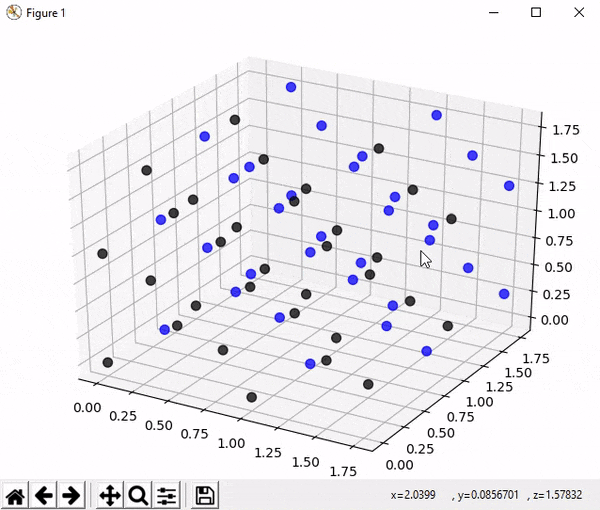

# CrystalGraphs

A tool for graphing multiple repetitions of the 3D Bravais lattices with a basis.

Images of the 3D Bravais lattices are easy to find, but I have not been able to find a simple method for viewing a 3D graph of many repetitions of the Bravais lattices with a specified basis. This module is a work in progress and currently allows for easily graphing the cubic, fcc, bcc, tetragonal, tetragonal body centered, and hexagonal crystal lattices.

As a quick example, using this module the crystal structure for diamond can be graphed in matplotlib by typing:

```
import CrystalGraphs
CrystalGraphs.fcc(2, [0,0,0,'black'], [.25,.25,.25,'blue'])
CrystalGraphs.show()
```

The number 2 specifies the number of times the unit cell will be repeated in the x, y, and z directions, and the other two arguments specify the basis of the lattice along with a color for the points. A demonstration of the output is below; on the left is the output of the code above, and on the right is the output of the code above with 3 repetitions instead of 2.

 

## REQUIREMENTS:

- matplotlib and NumPy must be installed.

## FUNCTIONS:

### Cubic
Graphs a cubic crystal with the specified basis.

`cubic(n, *args)`
- `n`: The number of times the unit cell will be repeated in the x, y, and z directions
- `*args`: The basis in the format `[a, b, c, 'color']` where `'color'` species the color the points will have

### fcc
Graphs a fcc crystal structure with the specified basis.

`fcc(n, *args)`
- `n`: The number of times the unit cell will be repeated in the x, y, and z directions
- `*args`: The basis in the format `[a, b, c, 'color']` where `'color'` species the color the points will have

### bcc
Graphs a bcc crystal structure with the specified basis.

`bcc(n, *args)`
- `n`: The number of times the unit cell will be repeated in the x, y, and z directions
- `*args`: The basis in the format `[a, b, c, 'color']` where `'color'` species the color the points will have

### Tetragonal
Graphs a tetragonal crystal structure with the specified basis.

`tetragonal(n, height_ratio, *args)`
- `n`: The number of times the unit cell will be repeated in the x, y, and z directions
- `height_ratio`: The ratio of the longer side to the two equal shorter sides; c/a
- `*args`: The basis in the format `[a, b, c, 'color']` where `'color'` species the color the points will have

### Tetragonal Body Centered
Graphs a tetragonal body centered crystal structure with the specified basis.

`tetragonal_bc(n, height_ratio, *args)`
- `n`: The number of times the unit cell will be repeated in the x, y, and z directions
- `height_ratio`: The ratio of the longer side to the two equal shorter sides; c/a
- `*args`: The basis in the format `[a, b, c, 'color']` where `'color'` species the color the points will have

### Hexagonal
Graphs a hexagonal crystal structure with the specified basis.

`hexagonal(n, height_ratio, *args)`
- `n`: The number of times the unit cell will be repeated in the x, y, and z directions
- `height_ratio`: The ratio of the longer side to the two equal shorter sides; c/a
- `*args`: The basis in the format `[a, b, c, 'color']` where `'color'` species the color the points will have
